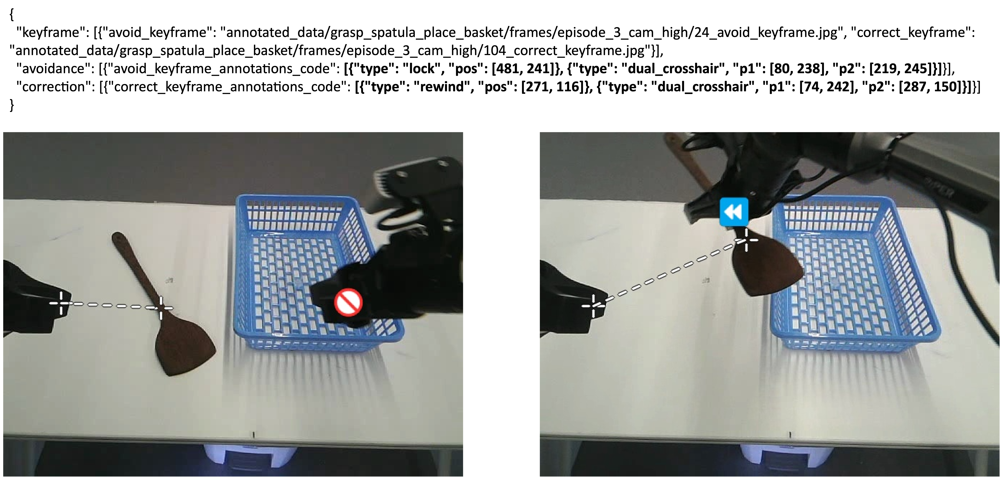
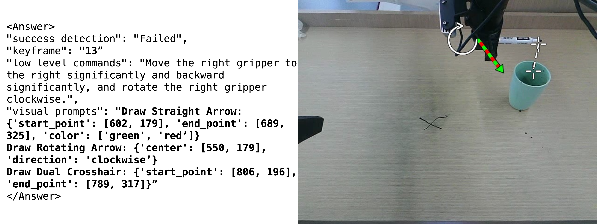

# ViFailback Framework: Diagnose, Correct, and Learn from Manipulation Failures via Visual Symbols

<p align="center">
  <a href="https://x1nyuzhou.github.io/vifailback.github.io/"></a>
  <a href="https://arxiv.org/abs/2512.02787"></a>
  <a href="https://huggingface.co/sii-rhos-ai/ViFailback-8B"></a>
  <a href="https://huggingface.co/datasets/sii-rhos-ai/ViFailback-Dataset"></a>
</p>

Official repository for the **CVPR 2026** paper **"Diagnose, Correct, and Learn from Manipulation Failures via Visual Symbols"**.

ViFailback is a comprehensive framework designed to diagnose robotic manipulation failures and provide both textual and visual correction guidance. By leveraging intuitive visual symbols (arrows, crosshairs, state icons), ViFailback bridges the gap between failure diagnosis and policy correction, allowing Vision-Language-Action (VLA) models to truly learn from and recover from real-world failures.

This repository provides the core utility scripts for parsing, rendering, and inferring the **Visual Symbols** used in the ViFailback framework and the **ViFailback-8B** Vision-Language Model (VLM).

## 🌟 Key Features

- **ViFailback Visual Symbols Rendering (`AnnotationRenderer`)**: A robust OpenCV-based engine that accurately translates structured text commands into the 7 distinct visual symbols defined in the paper:
  - *Motion Symbols*: Colored Straight Arrows (3D spatial movement), Semi-circular Arrows (rotation).
  - *Spatial Relation Symbols*: Crosshairs, Dual Crosshairs (alignment).
  - *State Symbols*: ON/OFF text, Prohibition (Lock), Rewind icons.
- **End-to-End Inference pipeline (`vifailback_infer.py`)**: A ready-to-use script to load **ViFailback-8B**, prompt it with failure rollout frames, extract the Chain-of-Thought (CoT) `<Answer>` blocks, and overlay the generated visual guidance directly onto the failure keyframe.

## 🛠️ Installation

### 1. Create a New Environment
We highly recommend creating an isolated virtual environment before installing the dependencies to avoid conflicts.

**Using Conda (Recommended):**
```bash
conda create -n vifailback python=3.10 -y
conda activate vifailback
```
### 2. Install Dependencies
Depending on your use case, choose one of the following installation options:

**Option 1: For rendering visual symbols only (Direct Draw)**

If you only need to parse and draw visual symbols onto images (e.g., using direct_draw.py), you only need the basic image processing libraries.

Install the dependencies:
```bash
pip install -r requirements_render.txt
```

**Option 2: For ViFailback-8B inference and rendering visual symbols**

If you plan to run the end-to-end VLM inference script (`vifailback_infer.py`), you need to install the deep learning and Hugging Face libraries in addition to the rendering tools.

*Hardware Requirement: Running our ViFailback-8B model in standard precision requires approximately 20-24 GB of GPU VRAM depending on the images' input size.*

Install the dependencies:
```bash
pip install -r requirements.txt
```


## 🚀 Usage
### 1. Direct Visual Symbol Drawing (`direct_draw.py`)
Use this script to visualize existing JSON datasets. It automatically handles both our raw ground-truth annotations and the outputs from VLMs (ShareGPT VQA template).

```bash
python direct_draw.py \
    --json_path ./examples/example_direct_draw.json \
    --dataset_root /path/to/ViFailback-Dataset \
    --output_dir ./direct_visualizations
```
A visualization example of the raw ground-truth annotations:

A visualization example of the outputs from VLMs:


### 2. ViFailback-8B Inference & Rendering (`vifailback_infer.py`)
Run real-time inference using the fine-tuned ViFailback-8B model (our LoRA checkpoints based on Qwen3-VL-8B-Instruct). The script parses the visual symbols from the model's CoT output and automatically overlays the corrective visual symbols onto the target keyframe.


```bash
python vifailback_infer.py \
    --model_path /path/to/ViFailback-8B \
    --json_path ./examples/example_vifailback_infer.json \
    --dataset_root /path/to/ViFailback-Dataset \
    --output_dir ./inference_visualizations
```

*Optional Flag: By default, the script assumes the model outputs normalized coordinates [0, 1000]. If you are testing a model that outputs absolute pixel coordinates, pass the --disable_normalization flag.*


## 📊 Dataset and Model
**🤗 ViFailback Dataset:** 58,128 high-quality VQA pairs across 5,202 real-world manipulation trajectories.

**🤗 ViFailback-8B Model:** Our fine-tuned Vision-Language Model for manipulation failure diagnosis and correction.

## 📝 Citation
If you find our paper, dataset, or code useful in your research, please consider citing our work:

```Code snippet
@article{zeng2025diagnose,
  title={Diagnose, Correct, and Learn from Manipulation Failures via Visual Symbols},
  author={Zeng, Xianchao and Zhou, Xinyu and Li, Youcheng and Shi, Jiayou and Li, Tianle and Chen, Liangming and Ren, Lei and Li, Yong-Lu},
  journal={arXiv preprint arXiv:2512.02787},
  year={2025}
}
```
